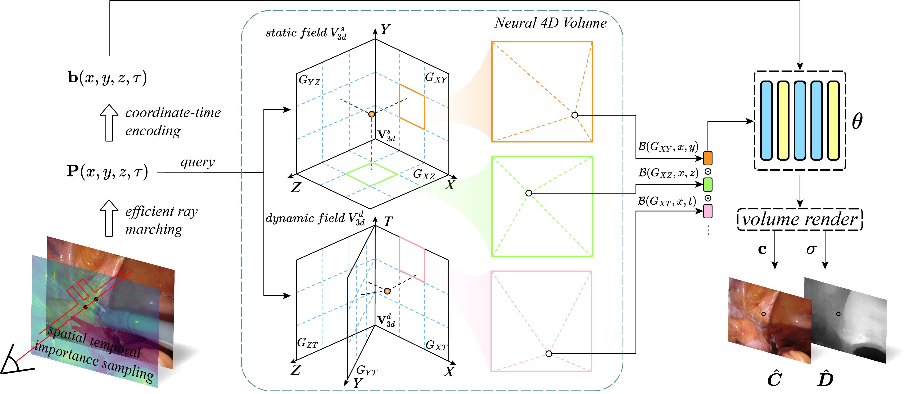

# Offical Code Implementation for Forplane and Lerplane

<p>
<a href="https://arxiv.org/abs/2305.19906">  </a>
<a href="https://arxiv.org/abs/2312.15253">  </a>
</p>


### [LerPlane](https://arxiv.org/pdf/2305.19906.pdf)

> [LerPlane: Neural Representations for Fast 4D Reconstruction of Deformable Tissues](https://arxiv.org/pdf/2305.19906.pdf) \
> Chen Yang, Kailing Wang, Yuehao Wang, Xiaokang Yang, Wei Shen \
> MICCAI2023, **Young Scientist Award**


### [Forplane](https://arxiv.org/pdf/2312.15253.pdf)

> [Efficient Deformable Tissue Reconstruction via Orthogonal Neural Plane](https://arxiv.org/pdf/2312.15253.pdf) \
> Chen Yang, Kailing Wang, Yuehao Wang, Qi Dou, Xiaokang Yang, Wei Shen \
> TMI2024



## Schedule
- [x] Initial Code Release of Lerplane.
- [x] Further check of the reproducibility.
- [x] Hamlyn Dataset.
- [x] Code clean and release for Forplane.
- [x] All the released code is tested on Ubuntu 22.04, Python 3.9, Pytorch 1.13.1, CUDA 11.7.

## Guidelines
This is the code repo for the paper "**LerPlane**: Neural Representations for Fast 4D Reconstruction of Deformable Tissues" and "**Forplane**: Efficient Deformable Tissue Reconstruction via Orthogonal Neural Plane". Since the Forplane is qualitatively and faster than Lerplane, we recommend you to use Forplane for your research, which is also the default setting in this repo. But if you want to reproduce the performance of Lerplane, you may modify the config file in the `forplanes/config` folder. For the dataset, please refer to the Instructions-Set up datasets section below. For the evaluation setting, please refer to the Instructions-Evaluation section below. 

<!-- ## Introduction
Reconstructing deformable tissues from endoscopic stereo videos in robotic surgery is crucial for various clinical applications. However, existing methods relying only on implicit representations are computationally expensive and require dozens of hours, which limits further practical applications. To address this challenge, we introduce LerPlane, a novel method for fast and accurate reconstruction of surgical scenes under a single-viewpoint setting. LerPlane treats surgical procedures as 4D volumes and factorizes them into explicit 2D planes of static and dynamic fields, leading to a compact memory footprint and significantly accelerated optimization. The efficient factorization is accomplished by fusing features obtained through linear interpolation of each plane and enabling the use of lightweight neural networks to model surgical scenes. Besides, LerPlane shares static fields, significantly reducing the workload of dynamic tissue modeling. We also propose a novel sample scheme to boost optimization and improve performance in regions with tool occlusion and large motions. Experiments on DaVinci robotic surgery videos demonstrate that LerPlane accelerates optimization by over 100× while maintaining high quality across various non-rigid deformations, showing significant promise for future intraoperative surgery applications. -->

[http://loping151.top/images/trainging_speed_vs_endo.mp4](https://user-images.githubusercontent.com/97866915/274361556-3cdcd11b-3bb1-46a4-bd01-c5e9de160828.mp4)

## Instructions

### Set up the Python environment
<details> <summary>Tested with an Ubuntu workstation i9-12900K, 3090GPU.</summary>

```
conda create -n lerplane python=3.9
conda activate lerplane
pip install -r requirements.txt
pip install git+https://github.com/NVlabs/tiny-cuda-nn/#subdirectory=bindings/torch 
```
We notice tiny-cuda-nn is sometimes not compilable on some latest GPUs like RTX4090(tested 2023.1). If you found `OSError` while installing tiny-cuda-nn, you can refer to this [issue](https://github.com/NVlabs/tiny-cuda-nn/issues/245) or this [article](https://zhuanlan.zhihu.com/p/643834111). We've successfully built the same env on an Ubuntu 22.04 workstation i7-13700K, 4090GPU with the commands above.
</details>

### Set up datasets
<details> <summary>Download the datasets</summary> 

Please download the dataset from [EndoNeRF](https://github.com/med-air/EndoNeRF) 

Download the Hamlyn dataset used in Forplane: [hamlyn_forplane](https://download.loping151.com/filelist/hamlyn_forplane)

To use the example config, organize your data like:
```
data
| - endonerf_full_datasets
|   | - cutting_tissues_twice
|   | - pushing_soft_tissues
| - hamlyn_forplane
|   | - hamlyn1
|   | - hamlyn2
| - YourCustomDatasets
```

If you want to generate your own dataset, we strongly recommend you to undisort the images first since most endoscopic images are distorted. You can use the `cv2.undistort` function in OpenCV to do this. And we also recommend you to use video-based SAM model to generate the masks of instruments for consistency.


</details>

### training
<details> <summary>Using configs for training</summary> 

Ferplane uses configs to control the training process. The example configs are stored in the `forplanes/config` folder. To run Lerplane, you need to modify the config according to the paper, but we recommend you use Forplane.
To train a model, run the following command:
```
export CUDA_VISIBLE_DEVICES=0
PYTHONPATH='.' python forplanes/main.py --config-path forplanes/config/example-9k.py
```
</details>

### Evaluation
We use the same evaluation protocol as [EndoNeRF](https://github.com/med-air/EndoNeRF). So please follow the instructions in EndoNeRF.

## Acknowledgements
We would like to acknowledge the following inspiring work:
- [EDSSR](https://arxiv.org/pdf/2107.00229) (Long et al.)
- [EndoNeRF](https://github.com/med-air/EndoNeRF) (Wang et al.)
- [K-Planes](https://sarafridov.github.io/K-Planes/) (Fridovich-Keil et al.)

Big thanks to [NeRFAcc](https://www.nerfacc.com/) (Li et al.) for their efficient implementation, which has significantly accelerated our rendering.

## Citation

If you find this code useful for your research, please use the following BibTeX entries:

```
@inproceedings{yang2023neural,
  title={Neural lerplane representations for fast 4d reconstruction of deformable tissues},
  author={Yang, Chen and Wang, Kailing and Wang, Yuehao and Yang, Xiaokang and Shen, Wei},
  booktitle={International Conference on Medical Image Computing and Computer-Assisted Intervention},
  pages={46--56},
  year={2023},
  organization={Springer}
}
```
and
```
@article{yang2024efficient,
  title={Efficient deformable tissue reconstruction via orthogonal neural plane},
  author={Yang, Chen and Wang, Kailing and Wang, Yuehao and Dou, Qi and Yang, Xiaokang and Shen, Wei},
  journal={IEEE Transactions on Medical Imaging},
  year={2024},
  publisher={IEEE}
}
```
